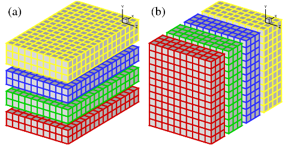

===============================
Domain Decomposition Strategies
===============================

1D Slab Decomposition
=====================

In early days, many applications based on structured meshes and using implicit numerical methods were based on a 1D domain decomposition (also known as slab decomposition). In Fig.1, a 3D domain is arbitrarily chosen to be decomposed in Y and X directions. It can be seen that in state (a), any computations in the X-Z planes can be done in local memories while data along a Y mesh-line is distributed. When it is necessary to calculate along Y mesh-lines (say to evaluate implicit Y-derivatives, or to perform 1D FFTs along Y), one can redistribute the data among processors to reach state (b), in which any computation in Y becomes 'local'. If using standard MPI library, swapping between state (a) and (b) can be achieved using `MPI_ALLTOALL(V)` subroutine.

Figure 1: 1D domain decomposition example using 4 MPI-processes (1 per slab): (a) decomposed in Y direction; (b) decomposed in X direction.

2D Pencil Decomposition
=======================

A 2D pencil decomposition (also known as a 'drawer' or 'block' decomposition) is a natural extension to 1D decompositions. Fig.2 shows that the same 3D domain as in Fig.1 can be partitioned in two dimensions. States (a), (b) and (c) are referred to as X-pencil, Y-pencil and Z-pencil arrangements, respectively. While a 1D decomposition algorithm swaps between two states, in a 2D decomposition one needs to traverse 3 different states using 4 global transpositions ((a) =>(b) => (c) => (b) => (a)).

.. image:: 2d_decomp.png
  :width: 1200

Figure 2: 2D domain decomposition example using a 4*3 mesh decomposition : (a) X-pencil; (b) Y-pencil; (c) Z-pencil.

Again `MPI_ALLTOALL(V)` can be used to realise the transpositions. However it is significantly more complex than the 1D case. There are two separate communicator groups. For a Prow*Pcol processor grid: Prow groups of Pcol processors need to exchange data among themselves for (a) <=> (b) ; Pcol groups of Prow processors need to exchange data among themselves for (b) <=> (c). For example, the red, green and blue processes in state (b) and (c) occupy exactly the same physical domain.

On one hand, the proper implementation of the communication routines can be quite tricky. For example the communications are very sensitive to the orientations of pencils and their associated memory patterns. The packing and unpacking of memory buffers for the MPI library must be handled with great care for efficiency. These are pure software engineering topics and are almost certainly irrelevant to the scientific researches conducted by the applications.

On the other hand, although the idea of 2D decomposition has long been established, its adoption in real applications was not essential until recently, when ordinary researchers can realistically expect to regularly use thousands of cores on major supercomputers, therefore hitting the limitation imposed by 1D decomposition.

These motivated the creation of the 2DECOMP&FFT library - a general-purpose domain decomposition library that can be reused by many applications - to handle these technical issues properly and to hide most software-engineering details from application developers who can concentrate on their scientific studies.

